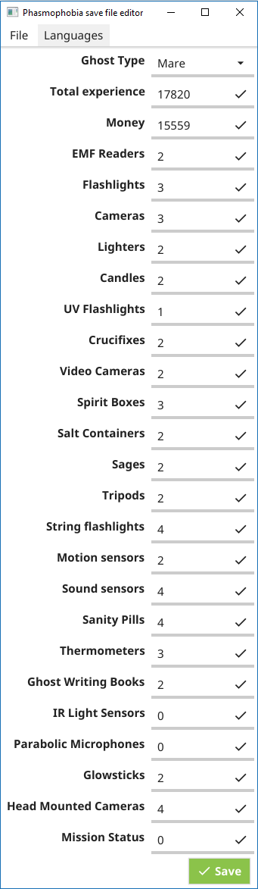

# Simple phasmophobia save editor
## Introduction
### Disclaimer
This tool is not intended for cheat but for people that lost their save and don't want to start from scratch again.

### How-to
Open the editor and edit the properties, be aware that the maximum amount of money before the anti-cheat resets it you is 250 000 so try to keep it lower, and item count should not exceed 99 for each type.

You can find pre-build releases [here](../../releases) or can build it yourself, instructions are below.
## Screenshot
<div align="center">



</div>

## Build instructions
Install the [fyne library](https://github.com/fyne-io/fyne#prerequisites)

If not installed yet you will need [MinGW-w64](https://sourceforge.net/projects/mingw-w64/files/)
```
$ go get fyne.io/fyne
```

Package traduction files using [packr]()
```
$ go get -u github.com/gobuffalo/packr/packr
$ packr
```

Then build the utility
```
$ go build -ldflags -H=windowsgui
```